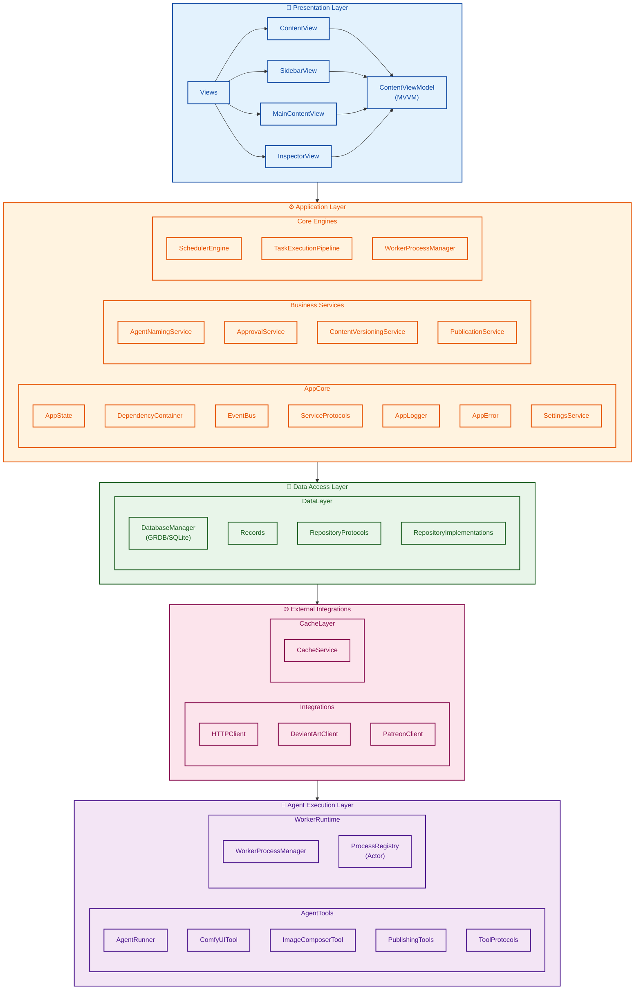

# Senor Platform Architecture

## Table of Contents

- [Overview](#overview)
- [System Architecture Diagram](#system-architecture-diagram)
- [Module Directory](#module-directory)
- [Atomic Module Descriptions](#atomic-module-descriptions)
  - [AppCore](#appcore)
  - [DataLayer](#datalayer)
  - [AgentTools](#agenttools)
  - [Integrations](#integrations)
  - [SchedulerCore](#schedulercore)
  - [TaskEngine](#taskengine)
  - [CacheLayer](#cachelayer)
  - [WorkerRuntime](#workerruntime)
  - [AgentNaming](#agentnaming)
  - [Views](#views)
- [Connection Architecture](#connection-architecture)
- [Data Flow](#data-flow)
- [Initialization Sequence](#initialization-sequence)

---

## Overview

Senor Platform is a macOS SwiftUI application for managing AI agents that generate and publish content. The architecture follows a layered, modular design with clear separation of concerns, dependency injection, and actor-based concurrency for thread safety.

**Core Paradigms:**
- **Layered Architecture**: Clear separation between UI, business logic, data access, and external integrations
- **Dependency Injection**: Centralized `DependencyContainer` using service locator pattern with lazy initialization
- **Actor-Based Concurrency**: Swift actors for thread-safe state management
- **Repository Pattern**: Abstracted data access with protocol-based repositories
- **Event-Driven Communication**: `EventBus` using Combine for decoupled component communication

---

## System Architecture Diagram



---

## Module Directory

| Module | Path | Responsibility | Key Files |
|--------|------|----------------|-----------|
| **[AppCore](#appcore)** | `senor-platform/AppCore/` | Core application infrastructure | [`DependencyContainer.swift`](senor-platform/AppCore/DependencyContainer.swift:1), [`EventBus.swift`](senor-platform/AppCore/EventBus.swift:1), [`ServiceProtocols.swift`](senor-platform/AppCore/ServiceProtocols.swift:1) |
| **[DataLayer](#datalayer)** | `senor-platform/DataLayer/` | Database access and persistence | [`DatabaseManager.swift`](senor-platform/DataLayer/DatabaseManager.swift:1), [`RepositoryProtocols.swift`](senor-platform/DataLayer/RepositoryProtocols.swift:1), [`Records.swift`](senor-platform/DataLayer/Records.swift:1) |
| **[AgentTools](#agenttools)** | `senor-platform/AgentTools/` | Agent execution and AI tools | [`AgentRunner.swift`](senor-platform/AgentTools/AgentRunner.swift:1), [`ToolProtocols.swift`](senor-platform/AgentTools/ToolProtocols.swift:1), [`ComfyUITool.swift`](senor-platform/AgentTools/ComfyUITool.swift:1) |
| **[Integrations](#integrations)** | `senor-platform/Integrations/` | External API clients | [`HTTPClient.swift`](senor-platform/Integrations/HTTPClient.swift:1), [`DeviantArtClient.swift`](senor-platform/Integrations/DeviantArtClient.swift:1), [`PatreonClient.swift`](senor-platform/Integrations/PatreonClient.swift:1) |
| **[SchedulerCore](#schedulercore)** | `senor-platform/SchedulerCore/` | Task scheduling engine | [`SchedulerEngine.swift`](senor-platform/SchedulerCore/SchedulerEngine.swift:1), [`ScheduleSpec.swift`](senor-platform/SchedulerCore/ScheduleSpec.swift:1) |
| **[TaskEngine](#taskengine)** | `senor-platform/TaskEngine/` | Task execution orchestration | [`TaskExecutionPipeline.swift`](senor-platform/TaskEngine/TaskExecutionPipeline.swift:1), [`ApprovalService.swift`](senor-platform/TaskEngine/ApprovalService.swift:1), [`PublicationService.swift`](senor-platform/TaskEngine/PublicationService.swift:1) |
| **[CacheLayer](#cachelayer)** | `senor-platform/CacheLayer/` | Remote API response caching | [`CacheService.swift`](senor-platform/CacheLayer/CacheService.swift:1) |
| **[WorkerRuntime](#workerruntime)** | `senor-platform/WorkerRuntime/` | Process management for external scripts | [`WorkerProcessManager.swift`](senor-platform/WorkerRuntime/WorkerProcessManager.swift:1) |
| **[AgentNaming](#agentnaming)** | `senor-platform/AgentNaming/` | Agent name generation | [`AgentNamingService.swift`](senor-platform/AgentNaming/AgentNamingService.swift:1) |
| **[Views](#views)** | `senor-platform/Views/` | SwiftUI user interface | [`ContentView.swift`](senor-platform/ContentView.swift:1), [`MainContentView.swift`](senor-platform/Views/MainContentView.swift:1), [`SidebarView.swift`](senor-platform/Views/SidebarView.swift:1) |

---

## Atomic Module Descriptions

### AppCore

**Location:** [`senor-platform/AppCore/`](senor-platform/AppCore/)

**Responsibility:** Foundation infrastructure and cross-cutting concerns for the entire application.

**Components:**

| File | Purpose |
|------|---------|
| [`DependencyContainer.swift`](senor-platform/AppCore/DependencyContainer.swift:1) | Service locator pattern implementation with actor-based thread safety. Supports eager registration, lazy factory-based registration, and lifecycle-aware services. |
| [`EventBus.swift`](senor-platform/AppCore/EventBus.swift:1) | Type-safe publish/subscribe event system using Combine. Replaces NotificationCenter with structured events (RefreshEvent, ActionEvent, StateChangeEvent). |
| [`ServiceProtocols.swift`](senor-platform/AppCore/ServiceProtocols.swift:1) | Protocol definitions for all business services enabling testability through mocking. |
| [`SettingsService.swift`](senor-platform/AppCore/SettingsService.swift:1) | Secure settings persistence using Keychain for credentials and UserDefaults for configuration. |
| [`AppLogger.swift`](senor-platform/AppCore/AppLogger.swift:1) | Structured logging system with domain-specific loggers (ui, api, database, scheduler, taskEngine, worker). |
| [`AppError.swift`](senor-platform/AppCore/AppError.swift:1) | Comprehensive error taxonomy with localized descriptions and recovery suggestions. |
| [`Keychain.swift`](senor-platform/AppCore/Keychain.swift:1) | Secure credential storage wrapper around macOS Keychain. |
| [`StatusEnums.swift`](senor-platform/AppCore/StatusEnums.swift:1) | Shared status enumerations used across the application. |
| [`StatusColor.swift`](senor-platform/AppCore/StatusColor.swift:1) | SwiftUI color mappings for status values. |
| [`JSONUtils.swift`](senor-platform/AppCore/JSONUtils.swift:1) | JSON serialization/deserialization helpers. |

---

### DataLayer

**Location:** [`senor-platform/DataLayer/`](senor-platform/DataLayer/)

**Responsibility:** All data persistence using SQLite via GRDB with repository pattern abstraction.

**Database Schema:**
- `agents` - Agent definitions with name generation metadata
- `task_types` - Schema-defined task type configurations
- `tasks` - Task definitions with metadata JSON
- `task_schedules` - Cron/recurring schedule configurations
- `task_runs` - Execution history with logs and exit codes
- `generated_content` - AI-generated content with versioning
- `generated_content_versions` - Content version history
- `approval_queue` - Content approval workflow state
- `publication_targets` - Platform-specific publication state
- `remote_post_cache` - API response cache with TTL

**Components:**

| File | Purpose |
|------|---------|
| [`DatabaseManager.swift`](senor-platform/DataLayer/DatabaseManager.swift:1) | Database connection pool, migration runner, and query dispatcher. Implements `LifecycleAware`. |
| [`Records.swift`](senor-platform/DataLayer/Records.swift:1) | GRDB-compatible Codable record structs for all database tables. |
| [`RepositoryProtocols.swift`](senor-platform/DataLayer/RepositoryProtocols.swift:1) | Repository interface contracts (AgentRepository, TaskRepository, etc.). |
| [`RepositoryImplementations.swift`](senor-platform/DataLayer/RepositoryImplementations.swift:1) | Concrete repository implementations with GRDB queries. |

---

### AgentTools

**Location:** [`senor-platform/AgentTools/`](senor-platform/AgentTools/)

**Responsibility:** AI agent execution framework with plugin-based tool system.

**Architecture:**
- Tools conform to [`AgentTool`](senor-platform/AgentTools/ToolProtocols.swift:4) protocol with JSON schema definitions
- [`ToolRegistry`](senor-platform/AgentTools/ToolProtocols.swift:257) actor for thread-safe tool discovery
- [`AgentRunner`](senor-platform/AgentTools/AgentRunner.swift:5) manages the complete agent lifecycle

**Components:**

| File | Purpose |
|------|---------|
| [`ToolProtocols.swift`](senor-platform/AgentTools/ToolProtocols.swift:1) | Core tool interfaces: AgentTool, ToolExecutionContext, ToolServiceProvider, ToolRegistry. |
| [`AgentRunner.swift`](senor-platform/AgentTools/AgentRunner.swift:1) | Main entry point for agent processes with LLM workflow execution. |
| [`ComfyUITool.swift`](senor-platform/AgentTools/ComfyUITool.swift:1) | Integration with ComfyUI for Stable Diffusion image generation. |
| [`ImageComposerTool.swift`](senor-platform/AgentTools/ImageComposerTool.swift:1) | Image manipulation and composition tool. |
| [`PublishingTools.swift`](senor-platform/AgentTools/PublishingTools.swift:1) | Platform-specific publishing tools (DeviantArt, Patreon). |

---

### Integrations

**Location:** [`senor-platform/Integrations/`](senor-platform/Integrations/)

**Responsibility:** External API integrations with authentication and rate limiting.

**Components:**

| File | Purpose |
|------|---------|
| [`HTTPClient.swift`](senor-platform/Integrations/HTTPClient.swift:1) | Base HTTP client with retry logic, authentication, and structured error handling. |
| [`DeviantArtClient.swift`](senor-platform/Integrations/DeviantArtClient.swift:1) | OAuth2-authenticated client for DeviantArt API (upload, gallery, stash). |
| [`PatreonClient.swift`](senor-platform/Integrations/PatreonClient.swift:1) | Patreon API client for creator posts and campaign management. |

---

### SchedulerCore

**Location:** [`senor-platform/SchedulerCore/`](senor-platform/SchedulerCore/)

**Responsibility:** Time-based task scheduling with cron-style expressions.

**Components:**

| File | Purpose |
|------|---------|
| [`SchedulerEngine.swift`](senor-platform/SchedulerCore/SchedulerEngine.swift:1) | Actor-based scheduler with 30-second polling loop. Handles recurring and one-time schedules, stale schedule reconciliation, and orphaned task cleanup. |
| [`ScheduleSpec.swift`](senor-platform/SchedulerCore/ScheduleSpec.swift:1) | Schedule specification DSL and compiler for calculating next run times from cron expressions. |

---

### TaskEngine

**Location:** [`senor-platform/TaskEngine/`](senor-platform/TaskEngine/)

**Responsibility:** Complete task execution lifecycle from trigger to publication.

**Components:**

| File | Purpose |
|------|---------|
| [`TaskExecutionPipeline.swift`](senor-platform/TaskEngine/TaskExecutionPipeline.swift:1) | End-to-end pipeline: validation → spawn worker → wait → ingest → queue for approval. Actor-based for thread safety. |
| [`ApprovalService.swift`](senor-platform/TaskEngine/ApprovalService.swift:1) | Content approval workflow management with batch operations. |
| [`PublicationService.swift`](senor-platform/TaskEngine/PublicationService.swift:1) | Multi-platform content publication orchestration. |
| [`ContentVersioningService.swift`](senor-platform/TaskEngine/ContentVersioningService.swift:1) | Content revision tracking with create/edit/revert operations. |
| [`TaskSchemaValidator.swift`](senor-platform/TaskEngine/TaskSchemaValidator.swift:1) | JSON Schema validation for task metadata against task type definitions. |

---

### CacheLayer

**Location:** [`senor-platform/CacheLayer/`](senor-platform/CacheLayer/)

**Responsibility:** Remote API response caching with TTL management.

**Components:**

| File | Purpose |
|------|---------|
| [`CacheService.swift`](senor-platform/CacheLayer/CacheService.swift:1) | Caching service for remote post metadata with expiration and cleanup. |

---

### WorkerRuntime

**Location:** [`senor-platform/WorkerRuntime/`](senor-platform/WorkerRuntime/)

**Responsibility:** External process management for Go/Python task scripts.

**Components:**

| File | Purpose |
|------|---------|
| [`WorkerProcessManager.swift`](senor-platform/WorkerRuntime/WorkerProcessManager.swift:1) | Process lifecycle management: spawn, monitor, terminate. Uses `ProcessRegistry` actor for thread-safe PID tracking. Creates log files in Application Support. |

---

### AgentNaming

**Location:** [`senor-platform/AgentNaming/`](senor-platform/AgentNaming/)

**Responsibility:** Unique agent name generation with categorization.

**Components:**

| File | Purpose |
|------|---------|
| [`AgentNamingService.swift`](senor-platform/AgentNaming/AgentNamingService.swift:1) | Generates unique agent names from categorized word lists (SciFi, Nature, Abstract, etc.) with collision detection. |

---

### Views

**Location:** [`senor-platform/Views/`](senor-platform/Views/)

**Responsibility:** SwiftUI user interface with MVVM pattern.

**Components:**

| File | Purpose |
|------|---------|
| [`ContentView.swift`](senor-platform/ContentView.swift:1) | Root view with NavigationSplitView (sidebar/content/inspector). |
| [`MainContentView.swift`](senor-platform/Views/MainContentView.swift:1) | Dashboard showing agents, tasks, content, and approvals. |
| [`SidebarView.swift`](senor-platform/Views/SidebarView.swift:1) | Navigation sidebar with view switching. |
| [`InspectorView.swift`](senor-platform/Views/InspectorView.swift:1) | Contextual details panel for selected items. |
| [`NewAgentView.swift`](senor-platform/Views/NewAgentView.swift:1) | Modal sheet for creating new agents. |
| [`NewTaskView.swift`](senor-platform/Views/NewTaskView.swift:1) | Modal sheet for creating new tasks with schedule builder. |
| [`JSONEditorView.swift`](senor-platform/Views/JSONEditorView.swift:1) | JSON editing component for task metadata. |
| [`SheetViews.swift`](senor-platform/Views/SheetViews.swift:1) | Settings and configuration sheets. |
| [`Views/Components/`](senor-platform/Views/Components/) | Reusable UI components (AsyncActionButton, ConfirmationDialog, ContentThumbnail). |

---

## Connection Architecture

### Dependency Injection Flow

```
┌─────────────────────────────────────────────────────────────────────────────┐
│                         DEPENDENCY RESOLUTION GRAPH                          │
└─────────────────────────────────────────────────────────────────────────────┘

AppState (senor_platformApp.swift:49)
    │
    ├──▶ DatabaseManager ──▶ GRDB Queue
    │
    ├──▶ Repositories (8x) ──▶ DatabaseManager
    │   ├── AgentRepository
    │   ├── TaskRepository
    │   ├── TaskScheduleRepository
    │   ├── TaskRunRepository
    │   ├── GeneratedContentRepository
    │   ├── ApprovalQueueRepository
    │   ├── PublicationTargetRepository
    │   └── RemotePostCacheRepository
    │
    ├──▶ Services ──▶ Repositories
    │   ├── AgentNamingService ──▶ AgentRepository
    │   ├── ContentVersioningService ──▶ GeneratedContentRepository
    │   ├── ApprovalService ──▶ ApprovalQueueRepository + GeneratedContentRepository + PublicationTargetRepository
    │   ├── PublicationService ──▶ [Multiple Repositories] + SettingsService
    │   ├── SettingsService ──▶ Keychain
    │   └── CacheService ──▶ RemotePostCacheRepository
    │
    ├──▶ WorkerProcessManager (standalone)
    │
    ├──▶ TaskExecutionPipeline ──▶ [7 Dependencies]
    │   ├── Repositories (4x)
    │   ├── WorkerProcessManager
    │   └── TaskSchemaValidator
    │
    └──▶ SchedulerEngine ──▶ [3 Repositories] + TaskExecutionPipeline callback

ContentViewModel (ContentView.swift:80)
    │
    └──▶ Resolves all repositories from sharedContainer on init
```

### Event Flow (EventBus)

```
┌─────────────────────────────────────────────────────────────────────────────┐
│                           EVENT BUS TOPOLOGY                               │
└─────────────────────────────────────────────────────────────────────────────┘

Publishers:                              Subscribers:
──────────                              ───────────
AppState.refreshAll()        ────────▶  ContentViewModel (data refresh)
UI Actions (create, delete)  ────────▶  Appropriate ViewModels
Service State Changes        ────────▶  UI updates
SchedulerEngine              ────────▶  TaskExecutionPipeline (task due)

Event Types:
- RefreshEvent: .all, .entities(agents/tasks/content/approvals/schedules/runs)
- ActionEvent: .createAgent, .createTask, .approveContent, .rejectContent, .publishContent
- StateChangeEvent: .loading, .error, .authenticated, .disconnected
```

### Data Flow: Task Execution

```
┌─────────────────────────────────────────────────────────────────────────────┐
│                     TASK EXECUTION DATA FLOW                                │
└─────────────────────────────────────────────────────────────────────────────┘

┌─────────────┐     ┌────────────────┐     ┌──────────────────┐     ┌─────────┐
│  Scheduler  │────▶│  TaskExecution │────▶│ WorkerProcess    │────▶│ External│
│   Engine    │     │    Pipeline    │     │    Manager       │     │ Process │
└─────────────┘     └────────────────┘     └──────────────────┘     └────┬────┘
     │                    │                        │                     │
     │                    │                        │                     │
     ▼                    ▼                        ▼                     ▼
┌─────────────┐     ┌────────────────┐     ┌──────────────────┐     ┌─────────┐
│TaskSchedule │     │  TaskRunRecord │     │  stdout/stderr   │     │  Output │
│  (nextRunAt)│     │  (status: run) │     │     Log Files    │     │  (JSON) │
└─────────────┘     └────────────────┘     └──────────────────┘     └────┬────┘
                                                                         │
                     ┌───────────────────────────────────────────────────┘
                     │
                     ▼
           ┌────────────────┐     ┌──────────────────┐     ┌─────────────┐
           │GeneratedContent│────▶│  ApprovalQueue   │────▶│Publication  │
           │    Record      │     │    (pending)     │     │  Targets    │
           └────────────────┘     └──────────────────┘     └─────────────┘
```

---

## Initialization Sequence

```
┌─────────────────────────────────────────────────────────────────────────────┐
│                     APPLICATION BOOT SEQUENCE                               │
└─────────────────────────────────────────────────────────────────────────────┘

Step 1: Database Initialization
  └─▶ DatabaseManager.init() → Create SQLite at ~/Application Support/SenorPlatform/
  └─▶ databaseManager.startup() → Run GRDB migrations

Step 2: Repository Registration
  └─▶ Register 9 repositories to DependencyContainer (all with DatabaseManager)

Step 3: Service Registration
  ├─▶ AgentNamingService (eager) ──▶ AgentRepository
  ├─▶ ContentVersioningService (eager) ──▶ GeneratedContentRepository
  ├─▶ ApprovalService (eager) ──▶ [3 Repositories]
  ├─▶ SettingsService (eager) ──▶ Keychain
  ├─▶ CacheService (lazy) ──▶ RemotePostCacheRepository
  ├─▶ PublicationService (eager) ──▶ [4 Repositories] + Settings
  ├─▶ DeviantArtClient (lazy factory) ──▶ Settings + HTTPClient
  └─▶ PatreonClient (lazy factory) ──▶ Settings + HTTPClient

Step 4: Worker Runtime Startup
  └─▶ WorkerProcessManager.startup() → Create logs directory, cleanup stale logs

Step 5: Task Execution Pipeline Creation
  └─▶ TaskExecutionPipeline ──▶ [7 Dependencies]

Step 6: Scheduler Engine Startup
  └─▶ SchedulerEngine.startup() → Start 30-second polling loop, reconcile schedules

All steps are sequential with error handling. Failure at any step aborts initialization
and displays error alert to user.
```

---

## Key Design Patterns

| Pattern | Implementation | Location |
|---------|---------------|----------|
| **Dependency Injection** | Service Locator + Constructor Injection | [`DependencyContainer.swift`](senor-platform/AppCore/DependencyContainer.swift:16) |
| **Repository** | Protocol-based with GRDB implementations | [`RepositoryProtocols.swift`](senor-platform/DataLayer/RepositoryProtocols.swift:1) |
| **MVVM** | ObservableObject ViewModels with SwiftUI Views | [`ContentView.swift`](senor-platform/ContentView.swift:80) |
| **Pub/Sub** | Combine-based EventBus | [`EventBus.swift`](senor-platform/AppCore/EventBus.swift:6) |
| **Actor Concurrency** | Swift actors for thread-safe state | [`SchedulerEngine`](senor-platform/SchedulerCore/SchedulerEngine.swift:8), [`TaskExecutionPipeline`](senor-platform/TaskEngine/TaskExecutionPipeline.swift:5) |
| **Plugin Architecture** | AgentTool protocol with registry | [`ToolProtocols.swift`](senor-platform/AgentTools/ToolProtocols.swift:4) |
| **Lifecycle Management** | LifecycleAware protocol with startup/shutdown | [`AppCore/DependencyContainer.swift`](senor-platform/AppCore/DependencyContainer.swift:4) |
| **Strategy Pattern** | ScheduleSpec compilation | [`ScheduleSpec.swift`](senor-platform/SchedulerCore/ScheduleSpec.swift:1) |

---

## Thread Safety Model

```
┌─────────────────────────────────────────────────────────────────────────────┐
│                         ACTOR ISOLATION MAP                                 │
└─────────────────────────────────────────────────────────────────────────────┘

Actor-Isolated Components:
━━━━━━━━━━━━━━━━━━━━━━━━━━━━
• DependencyContainer       - All service registration/resolution
• EventBus                  - Subscription management
• SchedulerEngine           - Schedule state and polling
• TaskExecutionPipeline     - Task execution coordination
• ToolRegistry              - Tool registration/lookup
• FileStatusReporter        - Status file writes
• ProcessRegistry           - PID tracking (private to WorkerProcessManager)

MainActor-Isolated:
━━━━━━━━━━━━━━━━━━━━
• AppState                  - UI state publication
• ContentViewModel          - View model observation
• All SwiftUI Views         - UI layer

Sendable Value Types:
━━━━━━━━━━━━━━━━━━━━━
• All Record structs        - Database entities
• All ViewModel structs     - UI state
• Configuration structs   - Settings
• DTOs and result types     - API responses
```

---

*Generated from source analysis on 2026-04-10*
